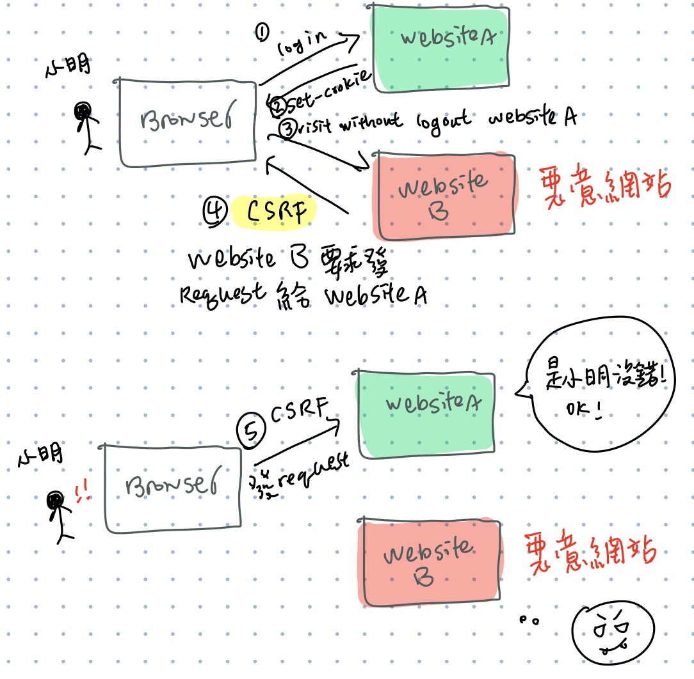

## 請說明雜湊跟加密的差別在哪裡，為什麼密碼要雜湊過後才存入資料庫

在開發上若存使用者直接提供的明文密碼會出現嚴重的資安問題，如果資料庫被惡意的第三方盜用，或者開發人員起了歹念，將有可能會導致使用者的帳號密碼都洩漏了出去。因此需要將密碼經過一些處理，例如加密或雜湊，以確保資訊安全性。

**加密 (Encryption)**

- 透過金鑰 (key) 來對原始密碼作加密和解密

- 加密前後的值為一對一的關係

- 分成對稱加密和非對稱加密兩種類別

  - 對稱加密 

    - 如: 凱薩加密法、AES
    - 利用同一個 key 來作加密和解密
    - 缺點是解密的一方也必須拿到 key，而 key 在傳輸中也可能被偷走，導致資料還是無法被保護到

  - 非對稱加密

    - 如: RSA
    - 利用兩個 key, 公鑰和私鑰來達成。
    - 安全性較對稱加密高，他利用公鑰來做加密只能用私鑰來解密，因為私鑰未曾經過網路傳輸，即便公鑰被取得也無法做解密。

    

**雜湊 (Hash)**

- 透過雜湊函式 (演算法) 來轉換原始密碼
- 加密前後的值為多對一的關係
- 通常轉換後的值會是一段以 16 進位表示的固定長度字串，稱為雜湊值。以 SHA-1 演算法為例，是以 20 bytes 組成的
- 雜湊還具備許多特性
  - 無論輸入值 (原始密碼) 的長度為何，都會轉換出固定長度的雜湊值
  - 轉換後的雜湊值和原先的密碼字元相似性獨立
  - 相同的輸入值去做雜湊保證得到相同的雜湊值
  - 由於雜湊值長度有限，必然可能發生不同輸入值得到相同的雜湊值，這樣的現象稱作 hash collision
  - 雜湊和加密最大的不同為不可逆的特性，雜湊值無法回推得到原本的密碼
- 常見的雜湊演算法：MD4, MD5, SHA-0, SHA-1, SHA-2。其中 SHA-2 為目前最常使用的方法。

## `include`、`require`、`include_once`、`require_once` 的差別

`include`、`require`、`include_once`、`require_once` 的用途大同小異，都是用來引入外部 php 檔到目前的 php 檔案。

include, include_once 和 require, require_once 這兩組的差別在於找不到外部引入檔時的行為，前者會跳出 warning，然後跑完接下來的程式碼，而後者則會報 fetal error，停止後續程式碼的運行。 換句話說，當你希望在外部檔案缺失時也要顯示結果給使用者就使用 include，但當網站架構複雜或十分龐大時，使用 require 可以確保結果的完整及準確。而有無 _once 在 include 和 require 當中分別表示會或不會再引入前確認檔案曾被引入過。

 

## 請說明 SQL Injection 的攻擊原理以及防範方法

惡意第三方注入字串到你的網站，使後端產生不合預期的 sql query ，他們以這個方式來冒充別人的身分或盜用資訊等等。

攻擊原理範例如下：

在後端處理 sql query 時，我們通常會做字串拼接，將要查詢的關鍵字傳進去，例如以下

狀況一: 如果帳號為帶有正確帳號和註解符號的組合如下 `aa'#`，他就可以成功把後面 password 的部分註解掉，因此，就可以在不傳入或者傳錯密碼的情況下，在只要知道使用者帳號情況底冒充這個使用者登入

狀況二: 如果帳號輸入帶有設計過的邏輯判斷式也有機會能夠入侵。如圖例，因 1=1 恆成立，加上後面的 password 也用傳入註解的方式規避，即便帳號密碼都不知道，也可得到使用者資訊。

狀況三: 用 sub-squery 的方式來撈資料庫裡面的資料

狀況四: 偽造別人身分留言 ，目前身分是 a，正常情況底下只能用 a 來發言，但因為一次可以新增多筆到資料庫裏面，所以用字串拼接的時候就可以下以下的 content 來多傳一筆，偽造了 admin 這個人的身分留言 'hi'

上述例子可得知，使用字串拼接 (如：sprintf()) 可能會產生許多資安疑慮，因此較推薦的方法就是用 prepared statement，他是 mysql 內建的方式，如此一來，惡意的字串就不會被當成 sql 指令去解釋，而是會被當成純文字。

##  請說明 XSS 的攻擊原理以及防範方法

XSS (Cross-site Scripting)

在別人的網站執行 JS 程式碼。原理舉例我們的留言板來說明，如果在留言輸入框裡面如果打入 html 標籤不會被當成純文字解釋，因為我沒有特別處理標籤字元跳脫，那些標籤就還是會正常被瀏覽器渲染出來。因此如果有心人士用 script tag 傳一段惡意程式碼進來例如: ``，例如將使用者導向到釣魚網站或者在裡面包 `document.cookie`，來把這個網站的 session id 偷走，偷走使用者的身分。

防範的方式即在所有使用者能夠掌控的地方去做字元跳脫，例如使用 php 的 **htmlspecialchars** 處理過，他會將 html 特殊字元解釋成純文字。

## 請說明 CSRF 的攻擊原理以及防範方法

CSRF Cross Site Request Forgery，跨站請求偽造

**CSRF 攻擊原理**

利用瀏覽器會自動在發 request 時帶上 cookie 這個特性。例如惡意網站利用使用者在其他網站取得尚未過期的 cookie ，在使用者不知情的情況下偽造使用者的身分發送 Request 給原網站。以下為舉例：

              1. 小明在他信任的 website A 登入了
              2. Website A 在 response header 帶了 set cookie
              3. 小明在 cookie 還未過期加上沒有登出 website A 的情況底下不小心訪問了惡意網站 Website B
              4. 此時 website B 想發動 CSRF 攻擊，以某種手段引誘小明在 website B 發 request 給 website A          
              5. 瀏覽器帶上了 website A 還有效的 cookie ，從 website B 發了 request 給 website A 
              6. website A 接收到來自小明的 request，經由 cookie 驗證是本人沒錯，但實際上小明沒有許可這個 request。

CSRF 的關鍵在於使用者是在不知情的情況之下，被惡意網站冒充身分發送了一些惡意的 request，這些可能包括了以發信件或者盜取帳號密碼，甚至是涉及一些金錢交易，侵害到使用者的隱私及財產安全。

**CSRF 防禦**

1. 使用者方面，我們可以確保在離開網頁之前要登出或避免瀏覽、點擊看起來可疑的網站或連結

2. Server 方面

   - 增加對 request 的驗證，例如轉帳前的圖形驗證或簡訊驗證，確定是使用者本人。此方法較麻煩，會減損使用者體驗，因此通常在操作敏感資訊時才會使用。
   - 檢查 request header 當中的 referer，這表示 request 從哪個 domain 發送，若非相同 domain 就 reject。但此方法存在許多缺點...
     - 不是所有瀏覽器都支援 referer
     - 使用者可能會關閉自動帶 referer，導致真實來自使用者的 request 也可能被擋掉
     - referer 可能被惡意更動
   - CSRF token 檢查。原理為在使用者表單安插一個 hidden input :`<input type="hidden" name="csrftoken" value="隨機生成的 csrf token"/>`，這隨機生成的 csrf token 由 server 端生成，存在 session 當中。因此當使用者送出表單就會把這個 token 帶到 server 端，server 端就可以藉由驗證是否和 session cookie 中的相同來確認是不是由使用者本人所發出的 request。而因為這個 csrf token 是一次性的，即便惡意第三方得知了也無法冒充使用者。

3. browser 方面

   - 在 set-cookie 後加上 SameSite，以阻擋瀏覽器在跨 domain 帶上 cookie。以嚴格程度分為兩種模式...

     - Strict，默認的模式，會阻擋來自不同 domain 的所有形式的 request 帶 cookie

     - Lax，較寬鬆的模式，放寬了不同形式 request 的限制，例如來自 a, link 或 GET  這些都可以帶上 cookie，其他 DELETE, POST 之類的就無法。

       

ref:

[浅谈CSRF攻击方式](https://www.cnblogs.com/hyddd/archive/2009/04/09/1432744.html)

[CSRF 攻擊是什麼？ 簡述](https://roy-coffee.medium.com/%E7%B0%A1%E8%BF%B0-csrf-%E6%94%BB%E6%93%8A%E6%98%AF%E4%BB%80%E9%BA%BC-78bb95d8ca7d)

[讓我們來談談 CSRF](https://blog.techbridge.cc/2017/02/25/csrf-introduction/)

[比較require(), include(), require_once(), include_once()](http://ps.hsuweni.idv.tw/?p=5003)

[W3 school PHP Include Files](https://www.w3schools.com/php/php_includes.asp)

