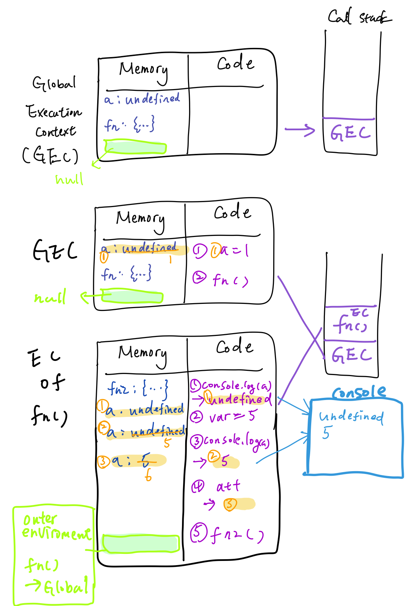
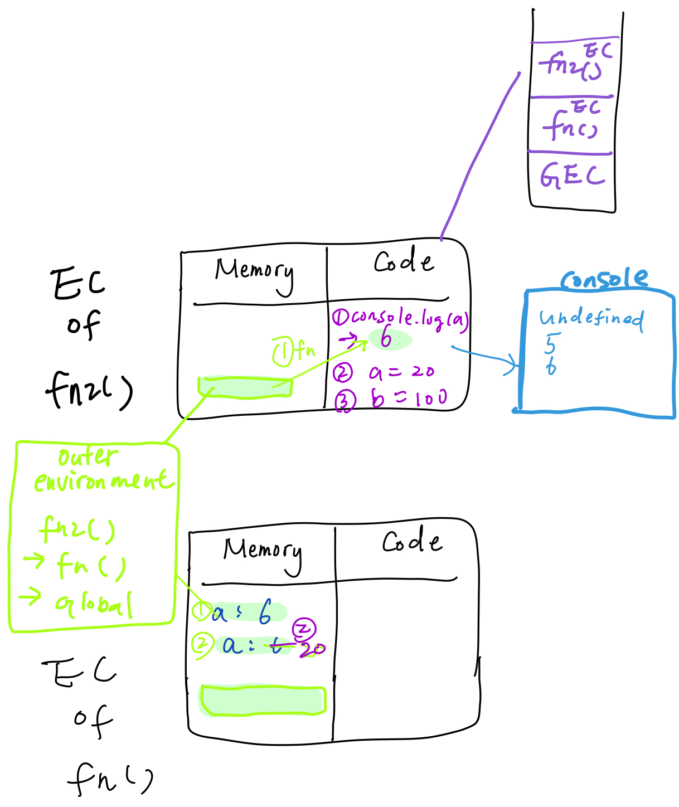
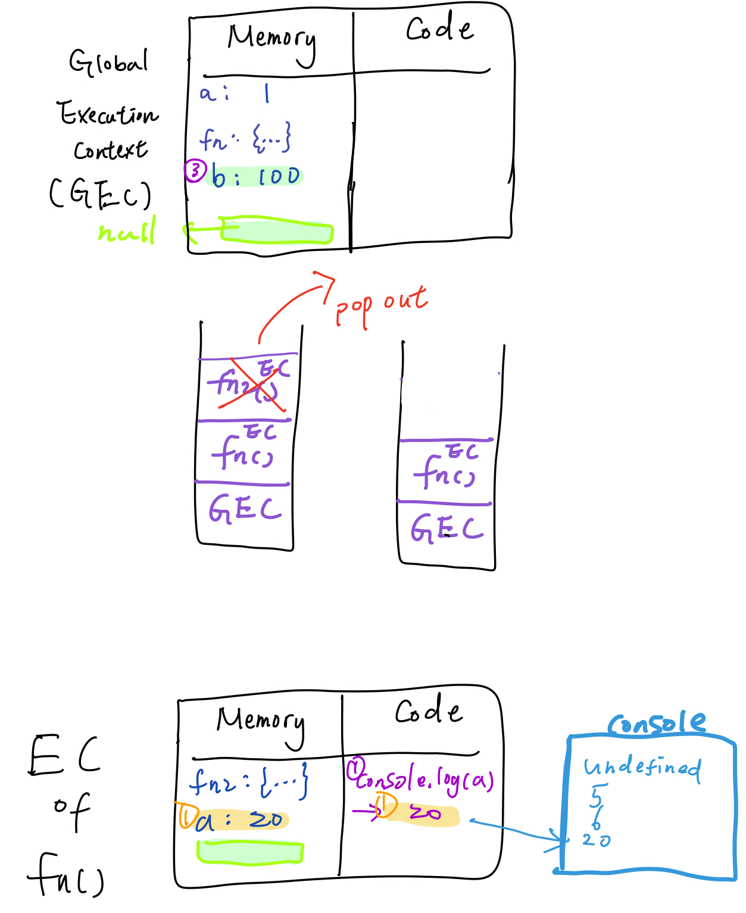
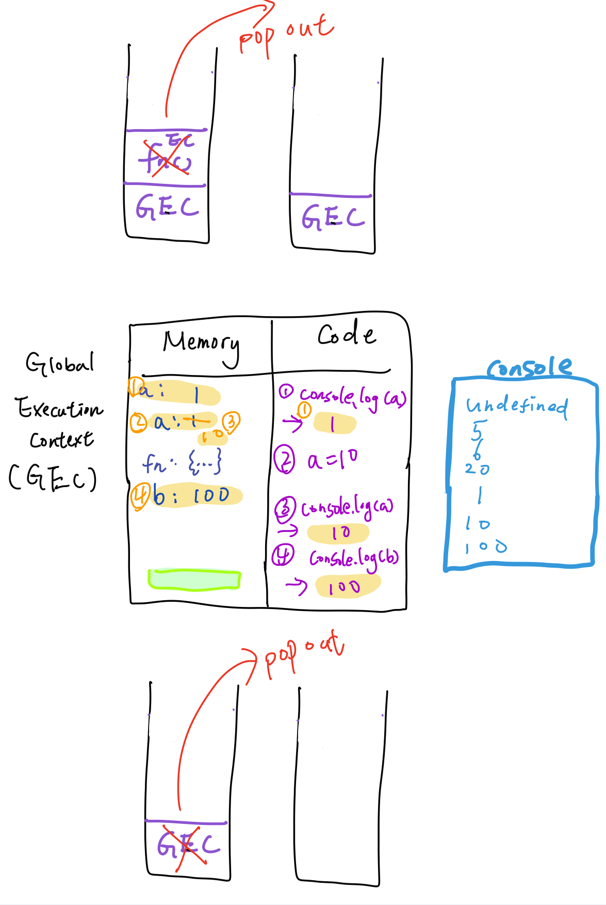

## hw3：Hoisting

請說明以下程式碼會輸出什麼，以及盡可能詳細地解釋原因。

``` js
var a = 1
function fn(){
  console.log(a)
  var a = 5
  console.log(a)
  a++
  var a
  fn2()
  console.log(a)
  function fn2(){
    console.log(a)
    a = 20
    b = 100
  }
}
fn()
console.log(a)
a = 10
console.log(a)
console.log(b)
```

1. JS engine 開始解析程式碼，將 Global Execution context (GEC) 放進 call stack。

2. 依據 Hoisting 底層運作原理 (見 [筆記](./note.md) - creation and hoisting)， GEC creation phase 會先設定 「宣告在全域 (global) 的變數」的記憶體位置

   - `var a = 1` : 記憶體位置被設定，名為 a，給定初始值 undefined。
   - `function fn(){...}` :  記憶體位置被設定，名為 fn，裡面的整段程式碼都被放進去，但這時候還沒有執行。

   > 每個 EC 都會有一個依據實際座落在程式碼脈絡中的位置 (lexical environment) 而定義的 outer environment ，通常會是一個接一個的形式，因此稱為 Scope chain，定義了能夠取得的變數範圍。圖當中都以綠色區域標示。Global 已經是最外層了，所以指向 null。

3.  Global EC creation phase 結束後就進入 code execution phase

   - 最先碰到的是 `var = 1`， a 被設定為 1。
   - 接著碰到 `fn()`，`fn()` 的 execution context 被放到 call stack。

4. `fn()` EC 進入 creation phase

   - `var a = 5` : 在 `fn()` local memory 設定記憶體位置，名為 a，給定初始值為 undefined。
   - `var a`  :  在 `fn()` local memory 已經存在 a，這段宣告就會被跳過。
   - `function fn2(){...}`  : 在 `fn()` local memory 設定記憶體位置，名為 fn2，裡面的整段程式碼都被放進去，但這時候還沒有執行。

   > Outer environment:  `fn() EC -> Global EC` 

5. `fn()` EC 進入 code execution phase

   - `console.log(a)` : 找 `fn()` EC  local memory 有無 a，有，印出 undefined。
   - `var a = 5`  : 在 `fn()` EC  local memory 找到 a，改為 5。
   - `console.log(a)` : 找 `fn()` EC  local memory 有無 a，有，印出 5。
   - `a++` : 在 `fn()` EC  local memory 找到 a，改成 6。
   - `fn2()` 的 execution context 被放到 call stack。



1. `fn2()` EC 進入 creation phase

   - 沒東西要宣告，直接進到 code execution phase

   > Outer environment: `fn2() EC -> fn() EC -> Global EC`

2. `fn2()` EC 進入 code execution phase

   - `console.log(a)` :  找 `fn2()` EC  local memory 有無 a，沒有，去 outer environment 找，先找到 `fn()`，找到 a 了，印出 6。
   - `a = 20` :  找 `fn2()` EC  local memory 有無 a，沒有，去 outer environment 找，先找到 `fn()` EC，找到 a 了，把 a 的值改成 20。
   - `b = 100` ：找 `fn2()` EC  local memory 有無 b，沒有，去 outer environment 找，先找到 `fn()` EC，沒找到 b，往外到 Global EC 找，也沒找到 b，再往外是 null，不往上了，在 Global EC 宣告變數 b 為 100。

3. `fn2()` 執行完畢，`fn2()` EC 從 call stack 被 pop out。

4. 回到 `fn()` 繼續執行

   - `console.log(a)` : 找 `fn()` EC  local memory 有無 a，有，印出 20

5. `fn()` 執行完畢，`fn()` EC 從 call stack 被 pop out。

6. 回到 Global 繼續執行

   - `console.log(a)` : 找 Global EC memory 有無 a，有，印出 1
   - `a = 10` : 把 Global EC 的 a 改成 10
   - `console.log(a)` : 找 Global EC memory 有無 a，有，印出 10
   - `console.log(b)` : 找 Global EC memory 有無 b，有，印出 100

7. 全部執行完畢，Global EC 從 call stack 被 pop out







console

```
Undefined
5
6
20
1
10
100
```


